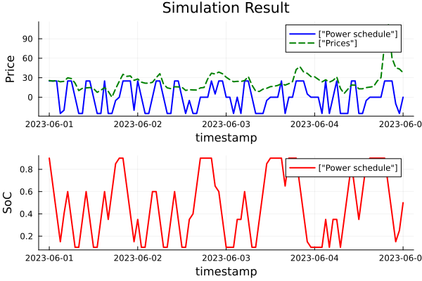

# BatteryOptimization [](https://github.com/purboday/BatteryOptimization.jl/actions/workflows/CI.yml?query=branch%3Amaster)

# BatteryOptimization.jl

Julia package designed for simulating the operation of battery energy storage systems (BESS) in various energy markets. The package provides tools to model battery characteristics, simulate market operations, and calculate the optimal power dispatch.

## Installation
To get started, ensure you have Julia installed on your system (version 1.6 or later is recommended).

- Begin by cloning the repository to your local machine:
```
git clone https://github.com/purboday/BatteryOptimization.jl.git
cd BatteryOptimization.jl
```

- Activate and instantiate the main project environment:
```
Pkg.activate(".")
Pkg.instantiate()
```

## Running the Example
The examples directory contains a working example of a 5 day battery simulation along with generation of plots of the results. The examples are contained within their own project environment to manage dependencies separately.

To run the example:
- Navigate to the examples directory.
- Activate the example environment.
- Run the example script.

The script also generates plots of the optimal power dispatched for each hour of the simulation that maximizes te revenue earned compared to the prices. A second plot shows the variation in the battery state of charge for each hour.

